# Homepage hero — three concepts for founder review

**Status: SELECTED and LIVE (03 Oct 2026).**
- The founder chose **A + C**. They alternate in the homepage hero every 10 s (`src/pages/Home.tsx` → `HeroRotator`).
- **B** is the homepage's "How it works" section.
- The whole public site moved to this light palette.
- Hero code lives in `src/components/hero/`.
- `/preview/home` now 301s to `/`.
- The concept pages below stay as noindex references.

The concepts live only on preview routes:

| Route | Concept |
|---|---|
| `/preview/heroes` | Index of all three |
| `/preview/hero-a` | HERO-A · Control plane canvas |
| `/preview/hero-b` | HERO-B · Four-stage ledger |
| `/preview/hero-c` | HERO-C · Catalogue field |

The preview routes are:
- prerendered with `<meta name="robots" content="noindex, nofollow">`
- served with `X-Robots-Tag: noindex, nofollow` (`/preview/*` in `_headers`)
- disallowed in `robots.txt`
- left out of the sitemap and unlinked from the site

`e2e/hero-preview.spec.ts` asserts all of that.

Source: `src/pages/preview/HeroConcepts.tsx`. It is a lazy chunk of 25.6 KB (7.6 KB gzip), so no other page loads it.
Stills: `audit/hero/`. Regenerate with `npm run build && npm run prerender && node scripts/hero-shots.mjs`.

## What all three share

- **Story:** connect → govern → execute → verify. The concepts show governed connections, policy and approvals, execution, receipts, and environment and operator controls.
- **Palette:** bright, soft-neutral and restrained.
  - background `#F5F6F8`, white surfaces, ink `#0B1220`
  - slate greys `#566074` and `#5E6779`, hairlines `#E3E7EE`
  - one blue accent, `#2850D8`
- **Avoided:** neon, glow, globes, robots, code rain, purple gradients and stock imagery.
- **Type:** Sora for headings, Inter for body text, JetBrains Mono for identifiers. These are the site's existing fonts.
  - The stills were rendered in a sandbox that blocks Google Fonts, so they show the system fallback. In a normal browser the real fonts load.
- **Scale without stale numbers.** Every figure comes from the catalogue at build time (`virtual:catalogue-summary`):
  - "1,000+ connectors catalogued" is `floor(TOTAL_CATALOGUED / 100) × 100`, followed by "+".
  - The published count is `PUBLISHED_COUNT` (809 today).
  - HERO-C draws exactly one square per catalogued connector.
  - The stale-count gate stays green.
- **Truthfulness:**
  - Product panels carry an "Illustrative" label.
  - Credentials appear only as vault references (`cref_••••`).
  - Receipts are "recorded", never "signed" or "cryptographically verified".
  - Production appears as "locked".
  - The copy says availability is enabled per connector and per environment. Nothing claims a connector is available to connect.
- **CTAs:** "Request access" (`/contact`) and "Explore the catalogue" (`/connectors`).
- **Accessibility:**
  - one `h1`
  - each animated panel is a `role="img"` with a text description; its decoration is `aria-hidden`
  - zero axe WCAG 2.1 A/AA violations
  - no horizontal overflow at 390, 768 or 1280 px
- **Motion rules (all three):**
  - **Sequence:** a short step sequence runs on a timer and rests on the final composed state (4–5 s) before restarting. It starts only when the hero is at least 35% visible and the tab is visible. It pauses off-screen and in background tabs.
  - **Easing:** `cubic-bezier(.2,.7,.2,1)`, 500–900 ms.
  - **Hover parallax:** `--px` / `--py` in [−1, 1] move layers by at most 2–6 px. It applies to fine pointers only (no touch), and returns to rest on pointer-leave.
  - **Scroll:** no scroll-jacking, no scroll-linked transforms. Scrolling the hero out of view pauses it; scrolling it back resumes.
  - **Reduced motion** (`prefers-reduced-motion: reduce`): no timer, no transitions and no parallax. The final composed state renders statically. A test asserts the panel does not change.
  - **Review flags:** `?frame=N` holds step N with transitions off. `?still=1` shows the final state.

---

## HERO-A — Control plane canvas

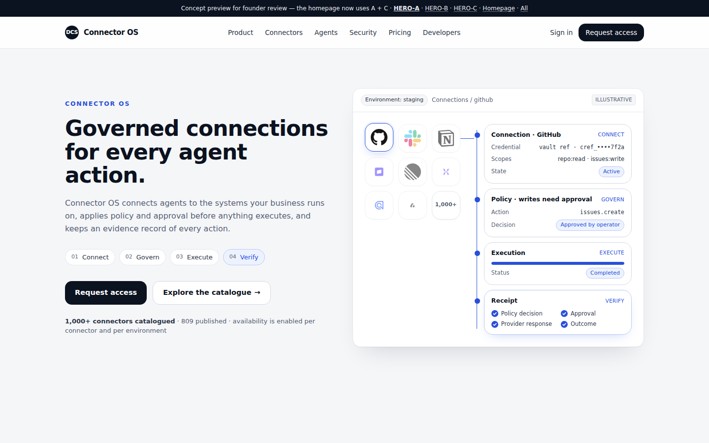

**Layout.** Split. On the left: headline "Governed connections for every agent action.", a supporting line, four numbered stage chips (Connect · Govern · Execute · Verify), the CTAs and the derived scale line. On the right: one white product canvas. It has an environment pill ("staging"), a breadcrumb, a 3×3 connector tile grid (eight published connectors plus a "1,000+" tile), and a lifecycle rail with four state cards: Connection, Policy, Execution, Receipt.

**Motion (5 steps, about 2.1 s each, 4.2 s rest).**

| Step | What happens |
|---|---|
| 0 | Tiles sit slightly unsettled (±8 px). Cards are dimmed. |
| 1 · Connect | Tiles settle into the grid. GitHub lifts with a blue ring; the other logos go greyscale. A single 28 px line draws to the rail. The rail fills to card 1: the connection is configured, with a vault reference. |
| 2 · Govern | The policy card activates: `issues.create` → "Awaiting approval". |
| 3 · Execute | The decision flips to "Approved by operator". The connection becomes "Active". The execution bar runs to 62% ("Running"). |
| 4 · Verify | Execution reaches "Completed". The receipt ticks Policy decision · Approval · Provider response · Outcome. The rail is full. |

The matching stage chip on the left highlights in step.

| Frame 0 | Frame 2 | Frame 4 |
|---|---|---|
| 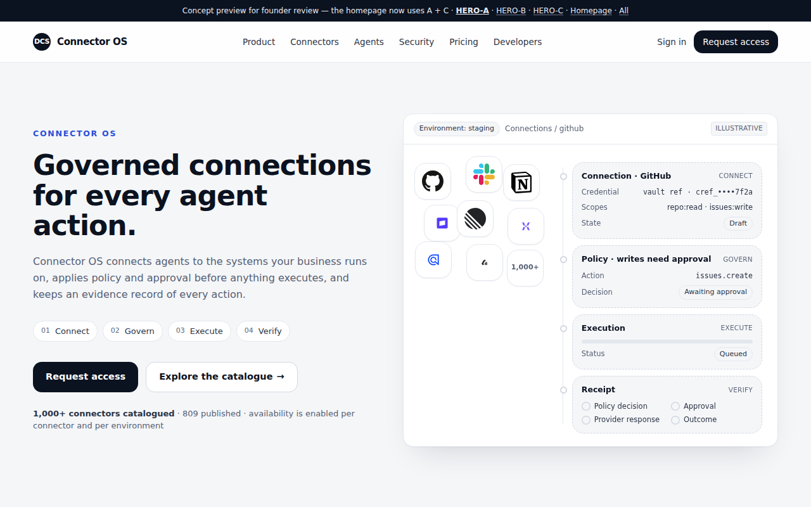 | 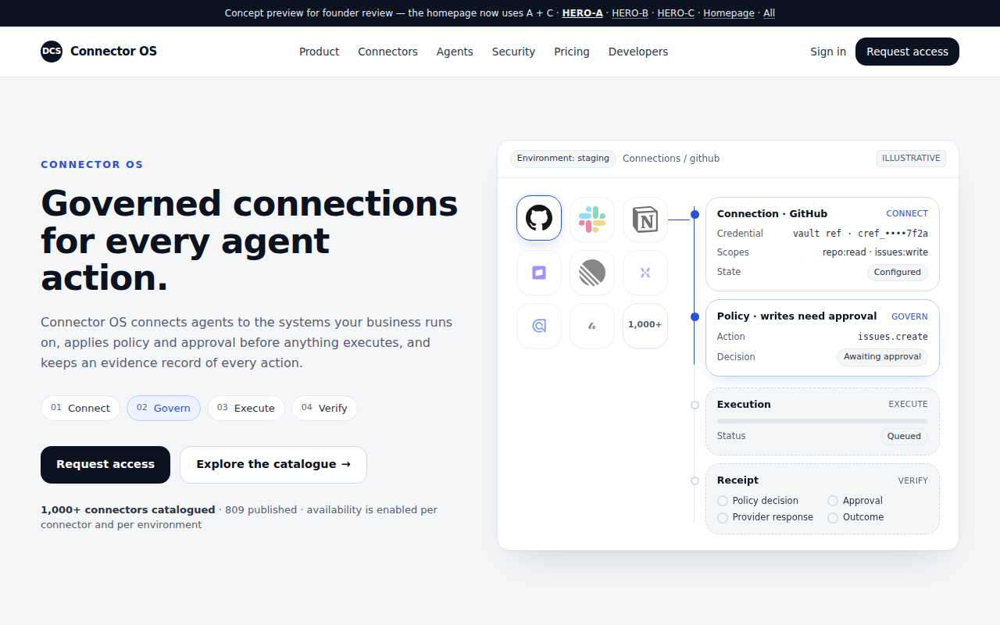 | 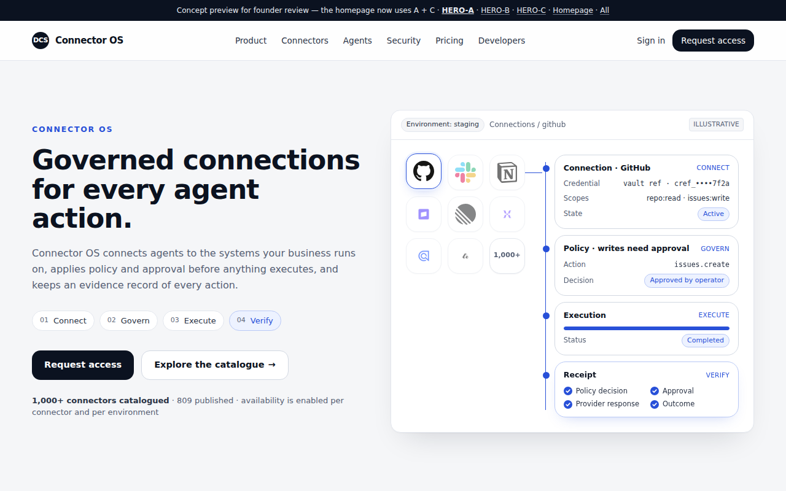 |

**Hover.** The canvas drifts by up to 4 px. The tile grid moves the opposite way (−3 px) and the rail moves with it (+2 px), which gives a shallow sense of depth.
**Mobile.** The panel stacks under the copy. The tile grid becomes one row of five logos plus "1,000+", above the rail. Stage chips wrap. ([mobile](hero/hero-a-mobile.png))
**Reduced motion.** Step 4 renders statically. ([still](hero/hero-a-reduced-motion.png))

**Rationale.** This is closest to a real product surface. One connector's whole governed lifecycle is legible in a single glance, and it shows the vault reference, approval and receipt explicitly.
**Trade-offs.** The canvas carries small UI text, so the scale story is secondary (one tile plus a line of copy). It is the densest of the three. It needs the most care if the console's real UI diverges from the mock.

---

## HERO-B — Four-stage ledger

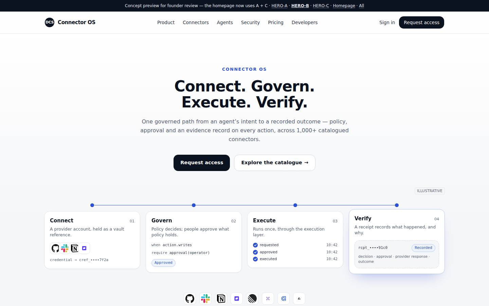

**Layout.** Centred. Headline "Connect. Govern. Execute. Verify.", then the supporting line (it includes the derived "1,000+ catalogued connectors"), then the CTAs. Below sits a band of four equal cards on a thin progress track:

| Card | Shows |
|---|---|
| Connect | Provider logos and `credential → cref_••••` |
| Govern | Policy lines `when action.writes / require approval(operator)` and a decision chip |
| Execute | requested / approved / executed with ticks |
| Verify | A receipt stub with "Recorded" |

A greyscale row of featured connector logos and the scale line close the hero.

**Motion (5 steps, about 2 s each, 4.2 s rest).** The track fills left to right to the active stage; its dot fills. The active card lifts 6 px with a soft blue-tinted shadow. Cards ahead stay at 62% opacity. Inside each card the state advances: "Held for approval" becomes "Approved", the ticks fill, and "Pending" becomes "Recorded".

| Frame 1 | Frame 2 | Frame 4 |
|---|---|---|
| 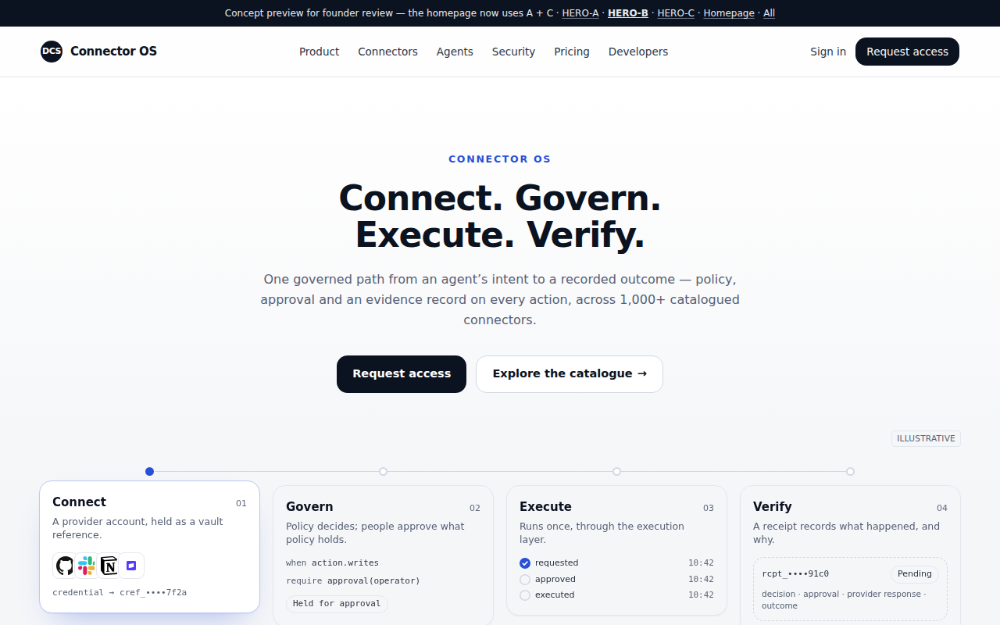 | 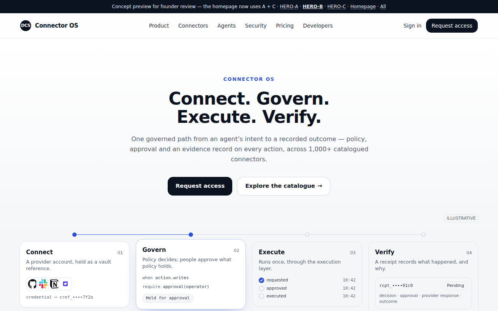 | 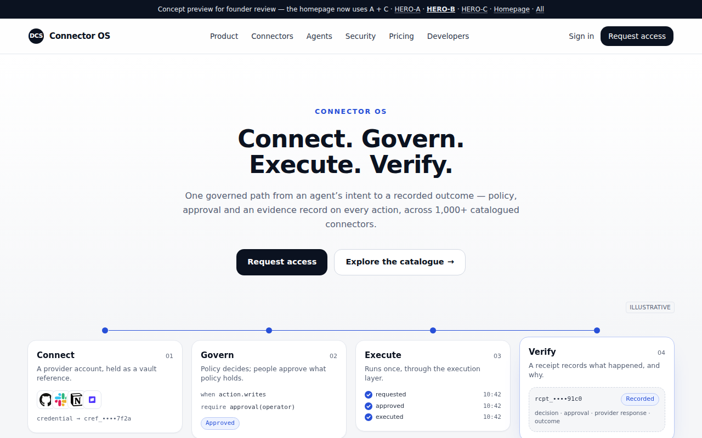 |

**Hover.** The whole band tilts at most 1.5° (`rotateX` / `rotateY` with perspective 1400), like a sheet of paper catching light.
**Mobile.** The band becomes a vertical timeline. The track runs down the left with a dot per card, and the cards are full width. ([mobile](hero/hero-b-mobile.png))
**Reduced motion.** All four stages complete; the Verify card is raised. ([still](hero/hero-b-reduced-motion.png))

**Rationale.** It states the product sentence as the headline, so it is the most memorable and most "category-defining" of the three. The calm, centred composition has the most whitespace, in the spirit of Stripe and Anthropic.
**Trade-offs.** It shows less product depth than A and less scale than C. The four cards repeat the headline's message, so the copy needs to stay tight. The visual sits low and may fall below the fold on 13" laptops.

---

## HERO-C — Catalogue field

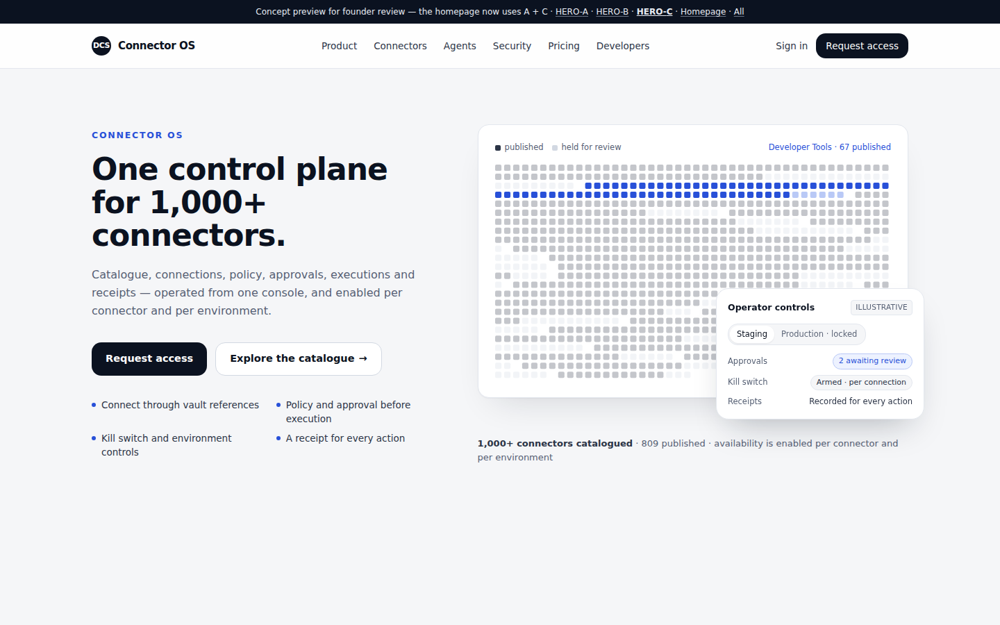

**Layout.** Split. On the left: headline "One control plane for 1,000+ connectors." (derived), a supporting line, the CTAs, and four proof points (vault references; policy and approval before execution; kill switch and environment controls; a receipt for every action). On the right: the catalogue field. It draws one square per catalogued connector (currently 1,010): dark for published, pale for held for review. A legend is included. An operator panel with environment (Staging, Production · locked), approvals, kill switch and receipts settles over the corner.

**Motion (4 steps, about 2.3 s each, 5.2 s rest).**

| Step | What happens |
|---|---|
| 0 | All squares are uniform silver, in interleaved order. Label: "1,010 catalogued". |
| 1 | The squares travel to category groups in a wave. Each moves for 900 ms, staggered up to about 300 ms. Published and held colouring appears. Label: "25 categories". |
| 2 | One category (Developer Tools) turns blue; the rest fade to 28%. Label: "Developer Tools · 67 published". |
| 3 | The operator panel rises 12 px into place. |

| Frame 0 | Frame 1 | Frame 3 |
|---|---|---|
| 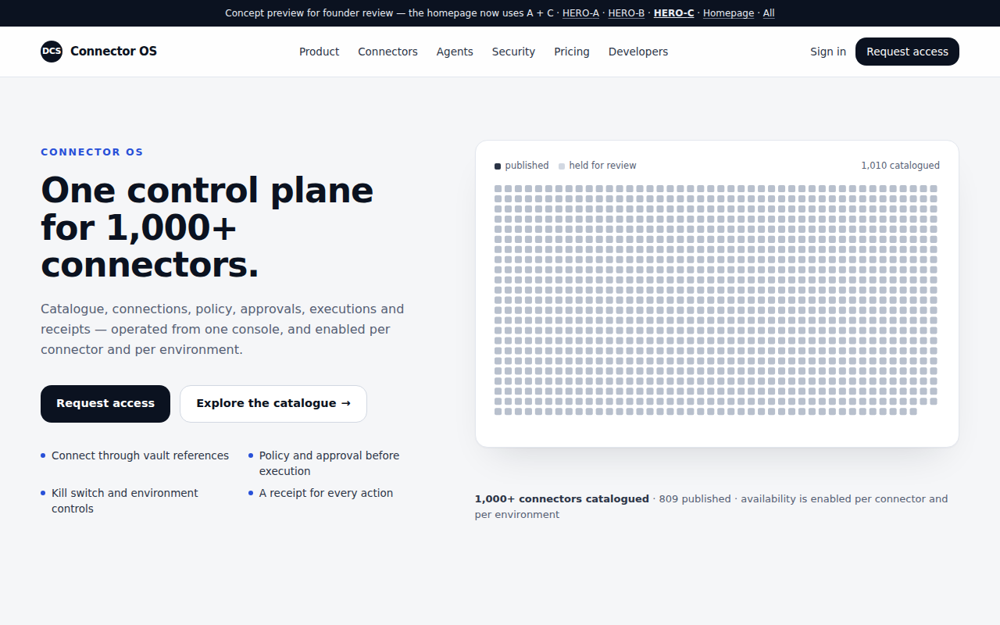 | 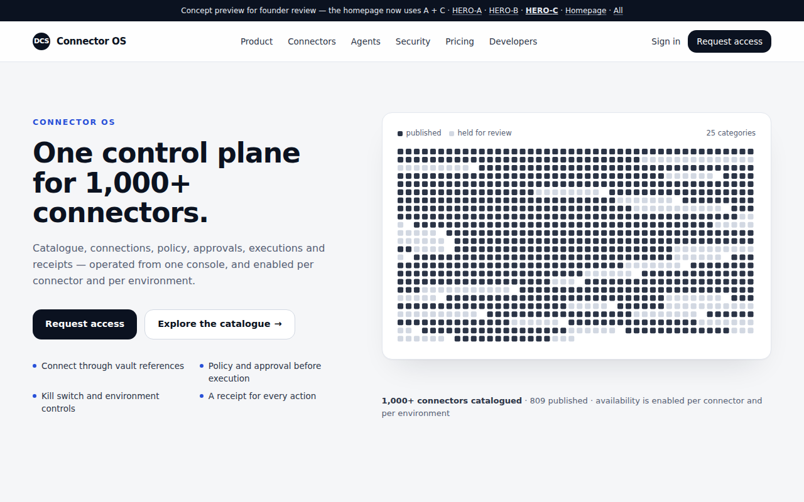 | 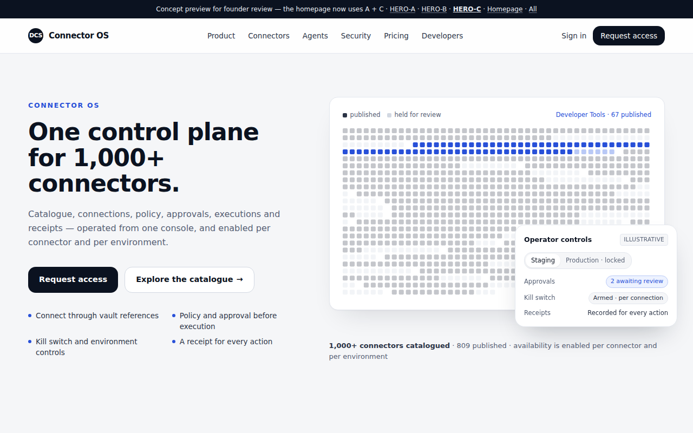 |

**Hover.** The field moves −3 px and the operator panel +5 px, which separates the two layers.
**Mobile.** The field scales down (it is SVG). The operator panel sits under the field instead of overlapping it. ([mobile](hero/hero-c-mobile.png))
**Reduced motion.** Grouped, highlighted, with the panel shown. ([still](hero/hero-c-reduced-motion.png))

**Rationale.** It is the only concept where scale is shown literally and honestly. The field updates by itself when core adds or holds rows, so the catalogue number can never go stale. Showing the held squares openly signals rigour. The operator panel carries the "governed" half of the story.
**Trade-offs.** It is more abstract, and the lifecycle (execute → receipt) is told in copy rather than shown. The 1,010-node SVG costs more to animate than A or B; it still runs smoothly in Chromium, and reduced motion removes the animation entirely. A field of squares can read as "data viz" rather than "product" to some visitors.

---

## Decision needed

Pick **HERO-A**, **HERO-B** or **HERO-C**. Changes are also welcome, for example C's field behind B's headline.

On selection:
1. Port the chosen hero into `src/pages/Home.tsx`.
2. Restyle the homepage sections below it to the same light palette, or keep the current dark sections under a light hero (founder's call).
3. Retire the other two previews, or keep them noindex for reference.
4. Re-run the full suite (axe, responsive, stale-count and smoke).
